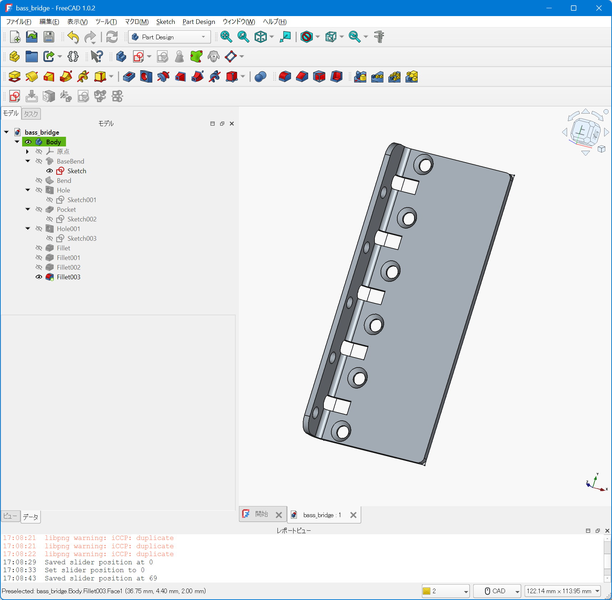
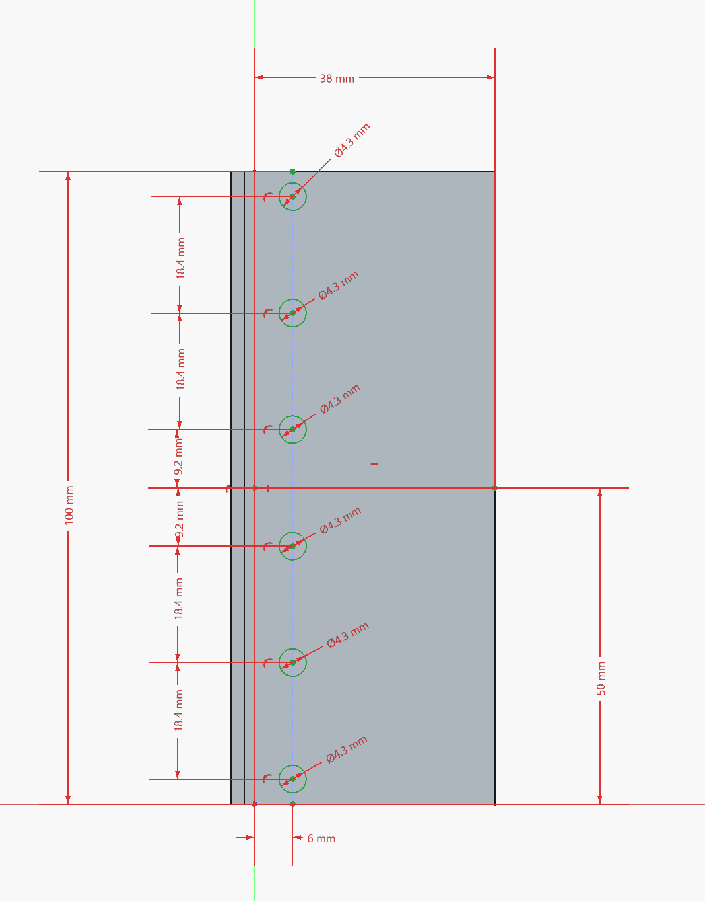
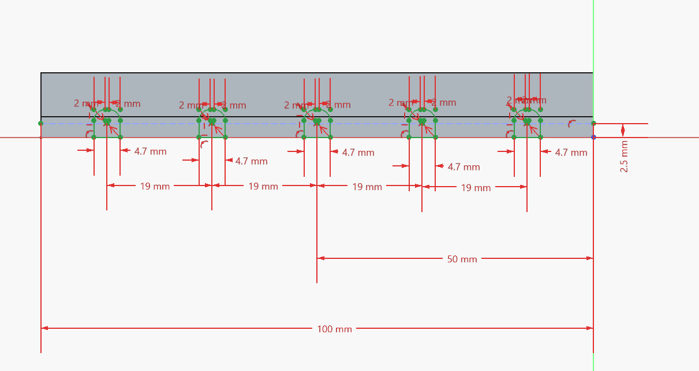
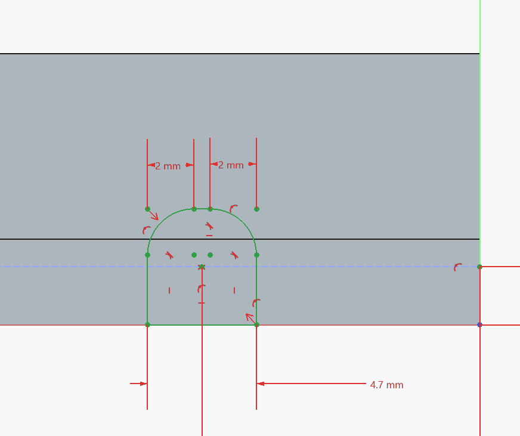
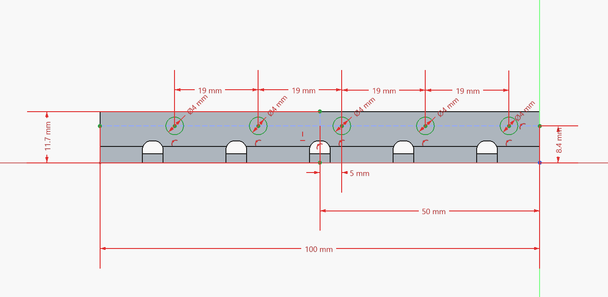

# 5弦ベース用ブリッジ3Dモデル

5弦ベース用のブリッジを作成するための3Dモデルです。この3Dモデルは板金加工での加工を意図して制作しています。

## 作業工程解説

FreeCADで本3Dモデルを作成する手順を[how_to_model_the_bridge](how_to_model/how_to_model_the_bridge.md)としてまとめています。ブリッジの寸法や穴の位置を変更したい場合、こちらが参考になるかもしれません。

## 寸法について

ブリッジを固定するためのネジ穴は「BADASS V」と同じ位置に配置しています。そのため、BADASS Vやその互換品（ALLPARTSの5弦ベース用「OMEGA BASS」、HIP SHOTの5STRING KICKASS BASS BRIDGEの「Mount Pattern 1」バージョン）から追加加工なしで置き換えが可能です。

ベースプレート部分の幅が41.7mm（ベース部分38mm＋曲げ部分3.7mm）、高さが100mmです。ネジ穴の間隔は18.4mmです。

弦間ピッチは19mmを想定しています。

サドルは19mmサイズのものを利用することを想定しています。

## ライセンス

[CC-BY 4.0](https://creativecommons.org/licenses/by/4.0/deed.ja)で提供しています。

